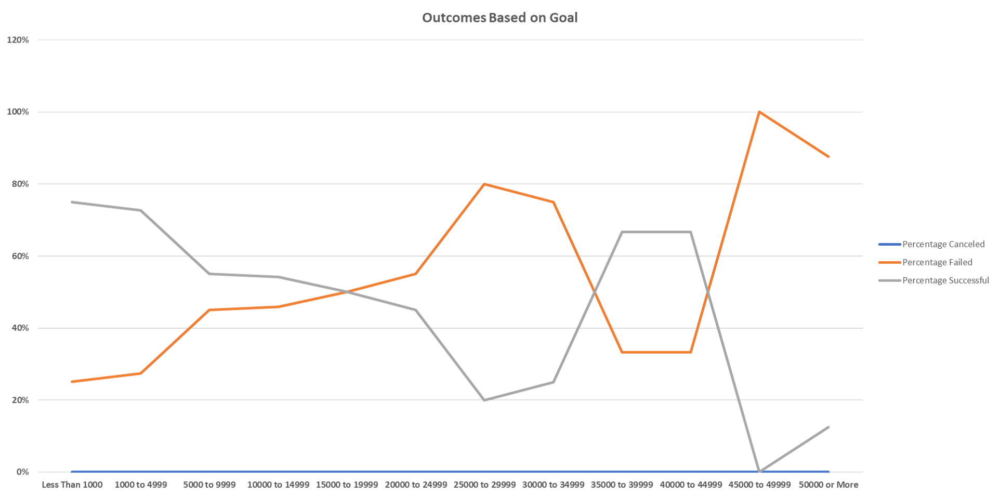

# Kickstarter_Analysis
## Overview of Project
The purpose of this project is to know how different campaigns fared in relation to their launch dates and their funding goalds. Hence using the Kickstarter dataset, two visualizations were created, first to show the campaign outcomes based on their launch dates and the second to show their funding goals.
## Analysis and Challenges
### Analysis
#### Theater Outcomes Based on Launch Date
For this analysis, a pivot table has been created to show the outcomes for the theater for each month. As shown in the image below, the number os successful outcomes were highest for Theater in the month of May and lowest in the month of November. Also no shows were canceled in the month of October. 

#### Outcomes Based on Goals
For this analysis, countif function was used to obtain the no.of. outcomes based on the goals. As seen on the below plot, the percentage successful was highest when the goals was less than 1000 and least when the goal was between 45,000 to 49,999. Also the percentage failes is inversely proportional to the percentage successful.

### Challenges
The challenges I faced during this analysis was to get the year out the sequence provided in the data. I overcome the challenege by converting the sequence into date and then obtaining the year from the date.
## Results
### Theater Outcomes by Launch Date
* No. of successful outcomes for the Theater were in the month of May
* No shows were canceled in the month of October
### Outcomes Based on Goals
* Most failed outcomes occured when the Goal is set between 45,000 to 49,999.
## Limitations and Recommendations
* Limitations would be more description could have been provided regarding the spotlight, staff_pick etc columns. It's hard to understand the use of these columns without any background description. It was quite challenging to understand the assignment. 
* More plots and analysis could be created using the country column to analyse how the outcomes are for each country for  certain category.
